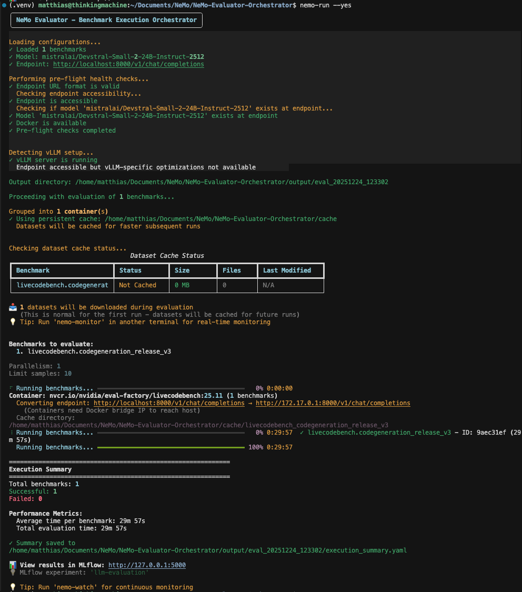
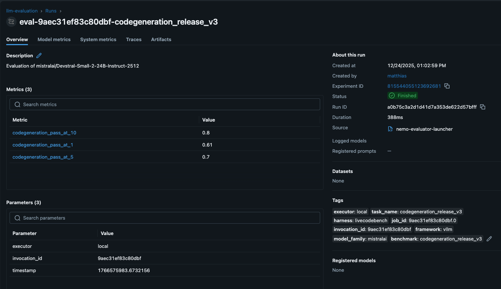
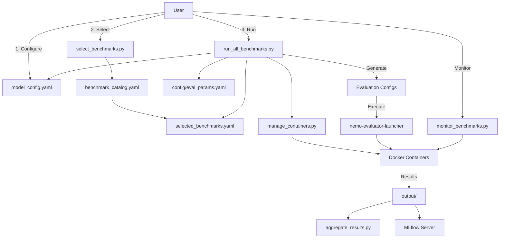

# NeMo Evaluator Orchestrator

[](https://www.python.org/downloads/)
[](LICENSE)
[](#vllm-specific-optimizations)
[](#enhanced-user-experience)

> A comprehensive orchestration tool for evaluating LLMs across 336+ NVIDIA benchmarks with intuitive `nemo-*` commands.

## Overview

The NeMo Evaluator Orchestrator simplifies the process of evaluating large language models (LLMs) using NVIDIA's NeMo Evaluator framework. Use the intuitive `nemo-*` commands to:

- **Select benchmarks** from 18+ containers with 336+ available benchmarks using `nemo-select`
- **Configure your model** with interactive setup using `nemo-vllm setup`
- **Run evaluations** with automatic container management using `nemo-run`
- **Track results** in MLflow for experiment management using `nemo-mlflow`
- **Cache datasets** for faster subsequent runs using `nemo-datasets`

Whether you're a researcher comparing model performance or an engineer validating deployments, this tool streamlines the entire evaluation workflow.

## Features

- 🎯 **Interactive Benchmark Selection**: Choose from preset suites, categories, or individual benchmarks
- 🐳 **Automatic Container Management**: Handles Docker container discovery, pulling, and verification
- ⚡ **Smart Execution**: Groups benchmarks by container for efficient execution
- 📊 **MLflow Integration**: Automatic export of results for experiment tracking
- 💾 **Persistent Caching**: Caches preprocessed datasets to speed up re-runs
- 🔍 **Real-time Monitoring**: Track progress with live container status and logs
- 🛠️ **Flexible Configuration**: Separate configs for models, evaluation parameters, and benchmarks
- 📈 **Results Aggregation**: Generate comprehensive reports from multiple benchmark runs

## Project Structure

```
nemo-evaluator/
├── src/
│   └── nemo_evaluator/
│       ├── cli/              # Command-line interface scripts
│       │   ├── run_all_benchmarks.py
│       │   ├── select_benchmarks.py
│       │   ├── aggregate_results.py
│       │   ├── monitor_benchmarks.py
│       │   ├── manage_containers.py
│       │   ├── show_system_status.py
│       │   └── generate_catalog.py
│       └── utils/            # Utility functions
│           ├── benchmark_utils.py
│           └── paths.py
├── config/                   # Configuration files
│   ├── model_config.yaml
│   ├── config/eval_params.yaml
│   ├── benchmark_catalog.yaml
│   ├── benchmark_suites.yaml
│   └── selected_benchmarks.yaml
├── docs/                     # Documentation
│   └── Architecture.md
└── pyproject.toml           # Package configuration
```

## Table of Contents

- [Installation](#installation)
- [Model Endpoint Setup](#model-endpoint-setup)
- [Configuration](#configuration)
- [Benchmark Selection & Execution](#benchmark-selection--execution)
- [Results & Analysis](#results--analysis)
- [Benchmark Categories](#benchmark-categories)
- [Architecture](#architecture)
- [Examples](#examples)
- [Troubleshooting](#troubleshooting)
- [Advanced Usage](#advanced-usage)
- [Contributing](#contributing)

## Installation

### Prerequisites

**Required:**
- Python 3.10+ (Python 3.12.3 recommended)
- Docker

**Optional but Recommended:**
- NVIDIA GPU with at least 24GB VRAM (for local model deployment)
- MLflow server (for experiment tracking)

### Setup Steps

1. **Clone the repository**:
   ```bash
   git clone https://github.com/mattdepaolis/NeMo-Evaluator-Orchestrator.git
   cd NeMo-Evaluator-Orchestrator
   ```

2. **Create virtual environment using uv**:
   ```bash
   # Install uv if not already installed
   curl -LsSf https://astral.sh/uv/install.sh | sh
   
   # Create virtual environment
   uv venv .venv
   source .venv/bin/activate  # On Windows: .venv\Scripts\activate
   ```

3. **Install the package**:
   ```bash
   # Install in editable mode (required for nemo-* CLI commands)
   uv pip install -e . --link-mode=copy
   ```

4. **Install vLLM** (required for local model deployment):
   ```bash
   # Install vLLM for local model serving
   uv pip install vllm --link-mode=copy
   ```
   
## Model Endpoint Setup

You need an OpenAI-compatible endpoint that exposes `/v1/chat/completions` (and optionally `/v1/completions`). The easiest way is using the interactive setup wizards:

### Interactive vLLM Setup (Recommended)

For the easiest setup experience, use the interactive vLLM setup wizard:

```bash
# Interactive setup with guided prompts
nemo-vllm setup

# This will:
# 1. Help you choose a model from popular options
# 2. Configure GPU settings and optimization
# 3. Start the vLLM server automatically
# 4. Update your model configuration
```

**Features:**
- **Model Selection**: Choose from popular models or enter custom HuggingFace IDs
- **Auto-Configuration**: Automatic GPU detection and optimal settings
- **Server Management**: Start, stop, and monitor vLLM servers
- **Config Integration**: Automatically updates your `model_config.yaml`

**Available Commands:**
```bash
nemo-vllm setup    # Interactive setup wizard
nemo-vllm status   # Check server status
nemo-vllm stop     # Stop running server
```

### MLflow Experiment Tracking

**MLflow** provides experiment tracking, metrics visualization, and model comparison for your evaluation results.

**Available Commands:**
```bash
nemo-mlflow start     # Start MLflow server (http://127.0.0.1:5000)
nemo-mlflow stop      # Stop MLflow server
nemo-mlflow status    # Check server status and experiment count
```

**Features:**
- **📊 Experiment Tracking**: Automatic logging of evaluation metrics and parameters
- **📈 Results Visualization**: Compare performance across models and benchmarks
- **🔍 Run History**: Track evaluation history and reproduce results
- **📁 Artifact Storage**: Store evaluation outputs and configurations
- **💬 Q&A Samples**: View actual questions and answers from evaluations

**Quick Start:**
```bash
# Start MLflow server (run in another terminal or background)
nemo-mlflow start &

# Run your evaluations
nemo-run --yes

# View results at http://127.0.0.1:5000
```

## Configuration

## Benchmark Selection & Execution

### Step 1: Select Benchmarks

Run the interactive selector (from the NeMo-Evaluator-Orchestrator root directory):

```bash
# Option 1: Use the entry point command (recommended)
nemo-select

# Option 2: Use the convenience script
./run_select.sh
```

**Selection Methods:**
1. **Preset Suites**: Quick validation, comprehensive, language_models, code_generation, math, safety, vision_language
2. **Categories**: Select all benchmarks in a category (Language Models, Code Generation, etc.)
3. **Individual**: Manually enter benchmark names
4. **Combine**: Mix and match methods

**Preset Suites:**
- **quick**: 5 benchmarks, ~30-60 min
- **language_models**: All language model benchmarks, ~4-8 hours
- **code_generation**: All coding benchmarks, ~3-6 hours
- **comprehensive**: All 336+ benchmarks, ~24-48 hours

### Step 2: Verify System Status

Check system status and container availability:

```bash
nemo-status
```

This provides a comprehensive overview of your system's readiness for evaluation.

### Step 3: Manage Datasets (Optional but Recommended)

For better performance and user experience, pre-load datasets before running evaluations:

```bash
# Check dataset cache status
nemo-datasets status

# Pre-load datasets for faster evaluation
nemo-datasets preload

# Clear cache if needed
nemo-datasets clear
```

**Benefits:**
- **Faster evaluation runs**: No waiting for dataset downloads during evaluation
- **Progress visibility**: See exactly what's being cached and how much space it uses
- **Offline capability**: Run evaluations without internet connectivity (for cached datasets)

### Step 4: Run Evaluations

Run from the NeMo-Evaluator-Orchestrator root directory:

```bash
nemo-run
```



**Enhanced Features:**
- **API Key Prompting**: If benchmarks require OpenAI API keys (e.g., `simple_evals.math_test_500`), you'll be prompted interactively. Press Enter to skip.
- **Dataset Loading Visibility**: Real-time progress indicators (📥) when datasets are being downloaded and cached
- **Smart Dataset Caching**: Automatic caching in `./cache` for faster subsequent runs with size tracking
- **vLLM Auto-Optimization**: Automatic detection and optimization for vLLM endpoints:
  - Optimized parallelism based on tensor parallel size
  - Memory utilization monitoring and recommendations
  - Reduced parallelism for high-memory usage scenarios
- **Container Health Monitoring**: Real-time container status and resource usage tracking
- **Enhanced Progress Bars**: Phase-specific status updates with detailed timing information
- **Error Handling**: Continues execution even if individual benchmarks fail

**Optional: Monitor Progress in Real-Time**
```bash
# In another terminal (from NeMo-Evaluator-Orchestrator root directory)
nemo-monitor
```

The monitor provides live updates showing:
- **Container Status**: Health indicators (✓ healthy, ✗ unhealthy, ⏳ starting)
- **Benchmark Progress**: Current phase (initializing, dataset_loading, evaluating)
- **Resource Usage**: CPU and memory consumption
- **Timing Information**: Elapsed time and estimated completion
- **Error Tracking**: Recent errors and warnings


**Non-Interactive Execution**
```bash
# Run evaluations without prompts (ideal for automation)
nemo-run --yes
```

**System Management**
```bash
# Check container availability and health
nemo-containers

# View comprehensive system status
nemo-status
```

## Results & Analysis

### View Results

- **MLflow UI**: http://127.0.0.1:5000 (navigate to "llm-evaluation" experiment)



- **Local Outputs**: `output/eval_<timestamp>/`
- **Aggregate Report**: `nemo-aggregate`

### MLflow Integration

**Auto-Export**: Results are automatically exported to MLflow after each benchmark completes when the MLflow server is running.

**Manual Export** (if needed):
```bash
nemo-evaluator-launcher export <invocation_id> --dest mlflow
```

## Benchmark Categories

The system supports evaluation across 6 major categories:

| Category | Benchmarks | Key Examples |
|----------|------------|--------------|
| **Language Models** | 125+ | MMLU, ARC, HellaSwag, GSM8K, TruthfulQA, AGIEval |
| **Code Generation** | 25+ | HumanEval, MBPP, LiveCodeBench, MultiPL-E, SciCode |
| **Vision-Language** | 7 | MMMU, ChartQA, MathVista, OCRBench, AI2D |
| **Safety & Security** | 3 | Aegis v2, WildGuard, Garak |
| **Specialized Tools** | 13+ | IFBench, ToolTalk, NeMo Skills, ProfBench |
| **Efficiency** | 2 | GenAI Perf (generation, summarization) |

## Architecture



**Key Components:**

| Component | Description |
|-----------|-------------|
| `nemo-select` | Interactive benchmark selection tool |
| `nemo-run` | Main execution orchestrator with enhanced progress reporting |
| `nemo-containers` | Docker container management and health monitoring |
| `nemo-aggregate` | Results aggregation and reporting |
| `nemo-monitor` | Real-time progress monitoring with live container status |
| `nemo-mlflow` | MLflow experiment tracking and UI management |
| `nemo-catalog` | Benchmark catalog generator |
| `nemo-status` | System status display |
| `nemo-datasets` | Dataset cache management and status tracking |
| `nemo-vllm` | Interactive vLLM server setup and management |

For detailed architecture documentation, see [Architecture.md](docs/Architecture.md).

## Examples

### Quick Model Validation

```bash
# 1. Setup model endpoint (interactive)
nemo-vllm setup
# Follow the prompts to choose model and configure server

# 2. Select quick suite (5 benchmarks for fast validation)
nemo-select
# Choose option 1, select "quick"

# 3. Optional: Check dataset cache status
nemo-datasets status

# 4. Run evaluation with enhanced progress reporting
nemo-run --yes

# 5. Check results in MLflow at http://127.0.0.1:5000

# 6. Stop server when done
nemo-vllm stop
```

### Comprehensive Evaluation

```bash
# 1. Setup model endpoint
nemo-vllm setup
# Choose a powerful model for comprehensive evaluation

# 2. Select comprehensive suite (all 336+ benchmarks)
nemo-select
# Choose option 1, select "comprehensive"

# 3. Check system readiness
nemo-status

# 4. Check dataset requirements
nemo-datasets status

# 5. Run evaluations (24-48 hours)
nemo-run --yes

# 6. Check results in MLflow at http://127.0.0.1:5000

# 8. Clean up when done
nemo-vllm stop
nemo-datasets clear  # Optional: free up disk space
```

### Custom Selection

```bash
# 1. Select by category
nemo-select
# Choose option 2, select "Code Generation"

# 2. Add individual benchmarks
# Choose option 4, then option 3
# Enter: simple_evals.mmlu, simple_evals.mmlu_pro

# 3. Run
nemo-run
```

## Troubleshooting

### Common Issues

**Connection Refused**
- Ensure model endpoint is running: `nemo-vllm status`
- Verify URL and port in `model_config.yaml`
- Use interactive setup: `nemo-vllm setup`

**Timeout Errors**
- Increase `request_timeout` in `config/eval_params.yaml`
- Reduce `parallelism` if server is overloaded
- Monitor server resources (GPU/CPU usage)

**API Key Errors**
- Set environment variable: `export OPENAI_API_KEY="your-key"`
- For HuggingFace gated models: `huggingface-cli login --token your-hf-token`
- Update `api_key_name` in config to match environment variable name

**Module Import Errors (`No module named nemo_evaluator.cli.select_benchmarks`)**
- This occurs if the package is not installed or `nemo-evaluator-launcher` provides a conflicting `nemo_evaluator` package
- **Solution:** Install the package in editable mode:
  ```bash
  pip install -e .
  ```
- **Then use the entry point commands:**
  ```bash
  nemo-select
  nemo-run
  nemo-containers
  nemo-monitor
  nemo-aggregate
  ```
- **Alternative (if entry points don't work):** Use `PYTHONPATH=src:$PYTHONPATH` prefix:
  ```bash
  PYTHONPATH=src:$PYTHONPATH python -m nemo_evaluator.cli.select_benchmarks
  ```

**MLflow Export Failures**
- Check MLflow server status: `nemo-mlflow status`
- Start MLflow if needed: `nemo-mlflow start`
- Export manually: `nemo-evaluator-launcher export <invocation_id> --dest mlflow`

## Advanced Usage

### Dataset Management

#### Check Dataset Cache Status
```bash
# Show cache status for all benchmarks
nemo-datasets status

# Show cache status for specific benchmarks
nemo-datasets status --benchmarks simple_evals.mmlu simple_evals.humaneval
```

#### Pre-load Datasets
```bash
# Pre-load all datasets
nemo-datasets preload

# Pre-load specific datasets
nemo-datasets preload --benchmarks simple_evals.mmlu simple_evals.humaneval

# Use more parallel workers for faster preloading
nemo-datasets preload --max-workers 5
```

#### Clear Dataset Cache
```bash
# Clear all dataset cache
nemo-datasets clear --yes

# Clear cache for specific benchmarks
nemo-datasets clear --benchmarks simple_evals.mmlu --yes
```

## Configuration Files

| File | Purpose |
|------|---------|
| `model_config.yaml` | Model endpoint and identification |
| `config/model_config.yaml` | Model endpoint and identification |
| `config/eval_params.yaml` | Global and per-benchmark evaluation parameters |
| `selected_benchmarks.yaml` | Selected benchmarks (generated) |
| `benchmark_catalog.yaml` | Complete benchmark catalog (generated) |
| `benchmark_suites.yaml` | Preset benchmark suite definitions |


### Best Practices

1. **Start Small**: Use the "quick" suite for initial testing with `nemo-select`
2. **Use Interactive Setup**: Run `nemo-vllm setup` for guided model and server configuration
3. **Check Dataset Status**: Use `nemo-datasets status` to see what needs caching
4. **Use Non-Interactive Mode**: Use `nemo-run --yes` for automation and scripting
5. **Full Evaluations**: Remove `limit_samples` for production runs
6. **Monitor Resources**: Watch GPU/CPU usage during execution with `nemo-monitor`
7. **Check MLflow**: View results at http://127.0.0.1:5000
9. **Save Configs**: Keep generated configs for reproducibility
9. **Document Models**: Use descriptive model IDs and metadata
10. **Use Caching**: Enable dataset caching for faster re-runs
11. **vLLM Optimization**: Use vLLM for better performance and automatic optimizations
12. **Version Control**: Track configuration files in version control

## Contributing

Contributions are welcome! Please feel free to submit a Pull Request. For major changes, please open an issue first to discuss what you would like to change.

1. Fork the repository
2. Create your feature branch (`git checkout -b feature/AmazingFeature`)
3. Commit your changes (`git commit -m 'Add some AmazingFeature'`)
4. Push to the branch (`git push origin feature/AmazingFeature`)
5. Open a Pull Request

## License

This project is licensed under the Apache License 2.0 - see the [LICENSE](LICENSE) file for details.

## Acknowledgments

- Built on top of [NVIDIA NeMo Evaluator](https://github.com/NVIDIA-NeMo/Evaluator)
- Uses [MLflow](https://mlflow.org/) for experiment tracking
- Container images from [NVIDIA NGC](https://catalog.ngc.nvidia.com/)

## Support

- **Documentation**: [Architecture Guide](Architecture.md) for detailed system design
- **NeMo Evaluator Docs**: [NeMo Evaluator Documentation](https://docs.nvidia.com/nemo/evaluator/)
- **GitHub**: [NVIDIA-NeMo/Evaluator](https://github.com/NVIDIA-NeMo/Evaluator)
- **Issues**: [GitHub Issues](https://github.com/NVIDIA-NeMo/Evaluator/issues)
- **Discussions**: [GitHub Discussions](https://github.com/NVIDIA-NeMo/Evaluator/discussions)

---
