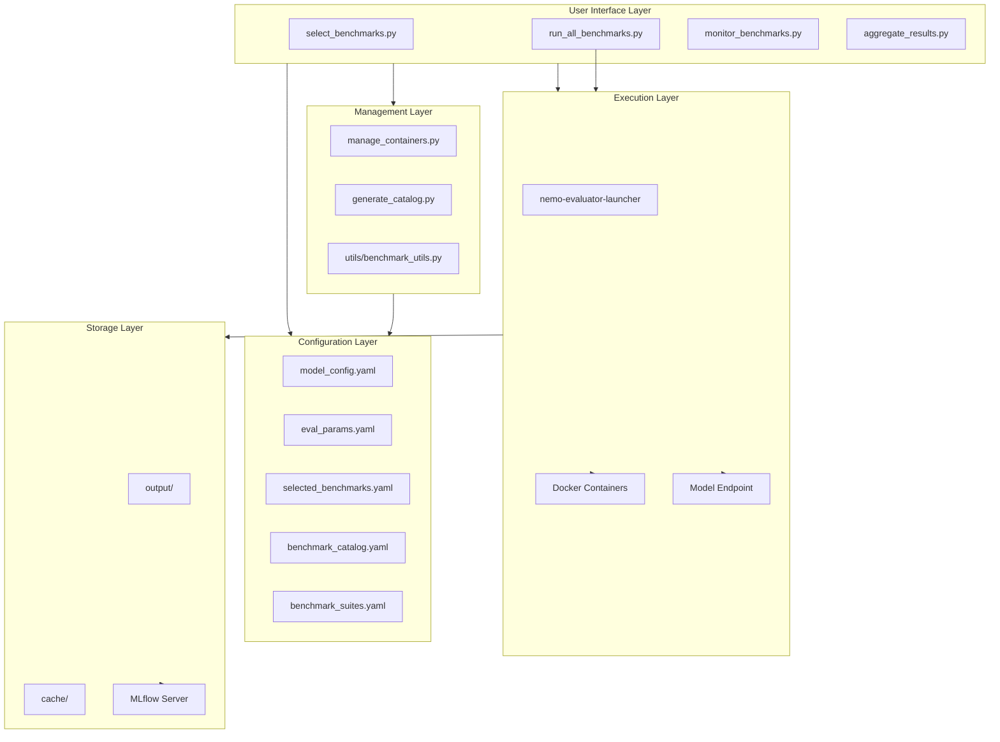
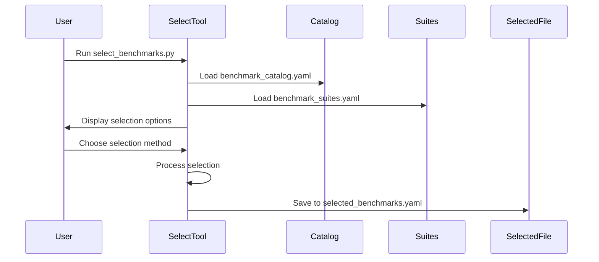
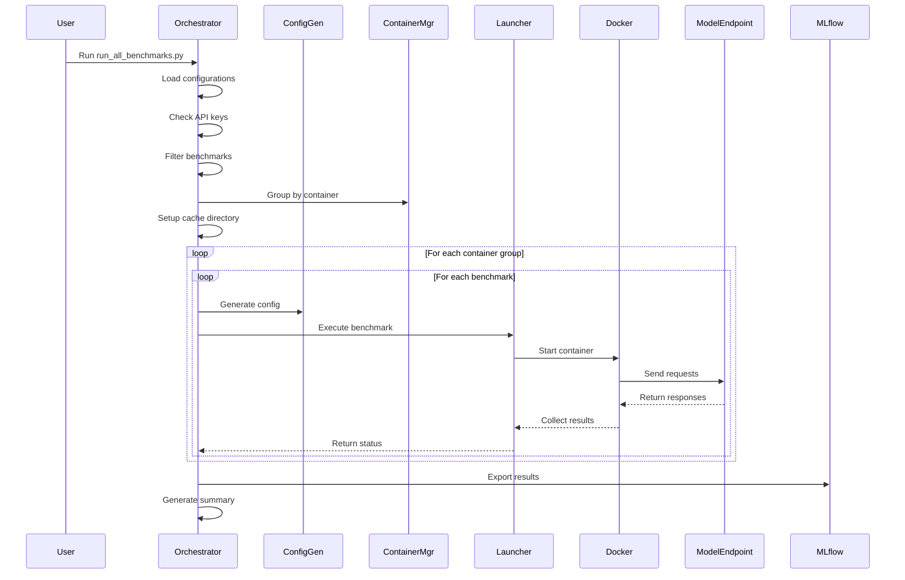
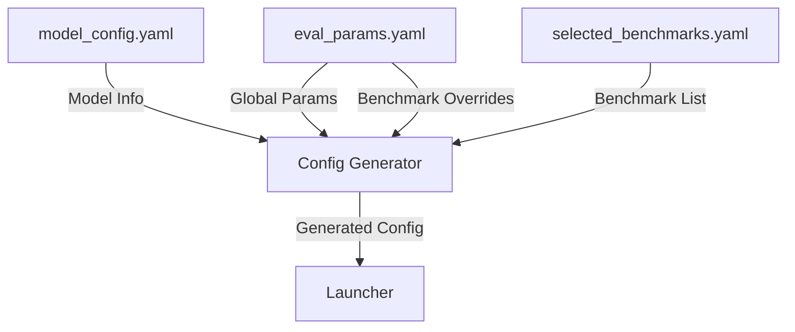
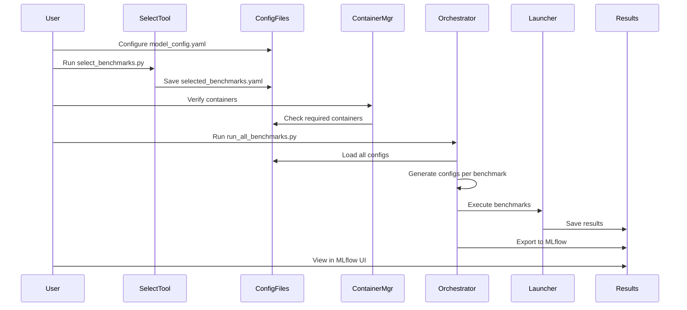
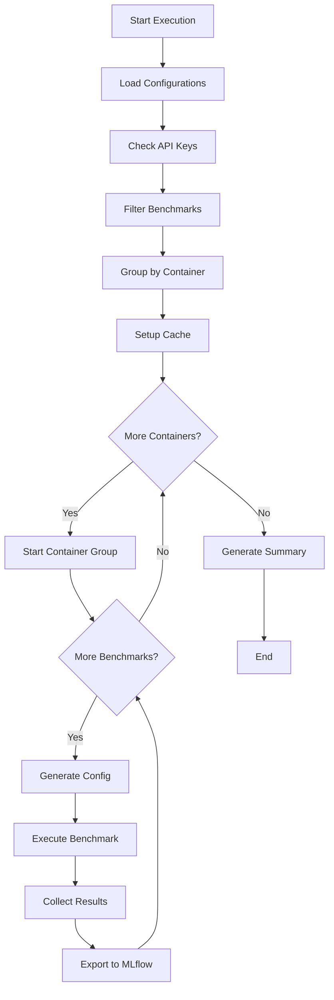
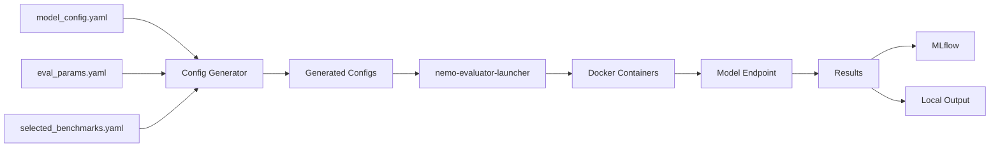

# Architecture

This document describes the architecture, design decisions, and implementation details of the NeMo Evaluator Orchestrator.

## Table of Contents

- [System Overview](#system-overview)
- [Core Components](#core-components)
- [Data Flow](#data-flow)
- [Design Decisions](#design-decisions)
- [Extension Points](#extension-points)
- [Configuration System](#configuration-system)
- [Execution Model](#execution-model)

## System Overview

The NeMo Evaluator Orchestrator is designed to simplify the evaluation of LLMs across 336+ benchmarks by providing:

- **Unified Configuration**: Single configuration for model and evaluation parameters
- **Automated Orchestration**: Handles container management, benchmark execution, and result collection
- **Flexible Selection**: Multiple ways to select benchmarks (presets, categories, individual)
- **Result Tracking**: Automatic MLflow integration for experiment management
- **Performance Optimization**: Dataset caching and container grouping for efficiency

### High-Level Architecture



## Core Components

### 1. Benchmark Catalog System

**Files**: `generate_catalog.py`, `benchmark_catalog.yaml`

**Purpose**: Discovers and catalogs all available benchmarks from NeMo Evaluator.

**How it works**:
1. Calls `nemo-evaluator-launcher ls tasks` to get benchmark list
2. Parses output to extract harness names, containers, and tasks
3. Organizes benchmarks by category (Language Models, Code Generation, etc.)
4. Saves structured catalog to YAML file

**Catalog Structure**:
```yaml
version: '1.0'
total_benchmarks: 336
harnesses:
  lm-evaluation-harness:
    container: nvcr.io/nvidia/eval-factory/lm-evaluation-harness:25.11
    category: Language Models
    task_count: 125
    tasks:
      - name: ifeval
        full_name: ifeval
        description: "IFEval is a dataset..."
```

**Update Mechanism**: Run `python generate_catalog.py` to regenerate when new benchmarks are added.

### 2. Benchmark Selection System

**Files**: `select_benchmarks.py`, `benchmark_suites.yaml`, `selected_benchmarks.yaml`

**Purpose**: Provides interactive interface for selecting benchmarks to evaluate.

**Selection Methods**:
1. **Preset Suites**: Predefined collections (quick, comprehensive, language_models, etc.)
2. **Category-Based**: Select all benchmarks in a category
3. **Individual**: Manually specify benchmark names
4. **Combined**: Mix and match methods

**Flow**:


**Preset Suite System**: Defined in `benchmark_suites.yaml`, allows easy selection of benchmark groups:
```yaml
suites:
  quick:
    description: Fast validation suite
    benchmarks:
      - ifeval
      - simple_evals.mmlu
```

### 3. Container Management System

**Files**: `manage_containers.py`

**Purpose**: Manages Docker containers required for benchmark execution.

**Functions**:
- **Discovery**: Identifies required containers from selected benchmarks
- **Verification**: Checks if containers are available locally
- **Pulling**: Pulls missing containers from NGC
- **Status Reporting**: Shows container availability status

**Container Resolution**:
1. Load selected benchmarks
2. Map benchmarks to harnesses using catalog
3. Map harnesses to containers
4. Check local Docker images
5. Report missing containers

**Key Features**:
- Handles both full names (`lm-evaluation-harness.ifeval`) and short names (`ifeval`)
- Groups by container for efficient management
- Provides pull functionality with NGC authentication

### 4. Execution Orchestrator

**Files**: `run_all_benchmarks.py`

**Purpose**: Main orchestrator that executes selected benchmarks.

**Execution Flow**:



**Key Features**:
- **Benchmark Grouping**: Groups benchmarks by container to minimize container restarts
- **Progress Tracking**: Real-time progress bars and status updates
- **Error Handling**: Continues execution even if individual benchmarks fail
- **API Key Management**: Interactive prompting for required API keys
- **Cache Integration**: Sets up persistent cache directories
- **MLflow Export**: Automatic export after each benchmark completes

**Configuration Generation**:
For each benchmark, generates a Hydra-compatible config file:
```yaml
defaults:
  - execution: local
  - deployment: none
  - _self_
execution:
  output_dir: output/eval_<timestamp>
  auto_export:
    destinations: ["mlflow"]
target:
  api_endpoint:
    url: http://172.17.0.1:8000/v1/chat/completions
    model_id: meta-llama/Llama-3.2-3B-Instruct
evaluation:
  nemo_evaluator_config:
    config:
      params:
        request_timeout: 3600
        parallelism: 1
        cache_dir: ./cache/ifeval
  tasks:
    - name: ifeval
export:
  mlflow:
    tracking_uri: http://127.0.0.1:5000
    experiment_name: llm-evaluation
```

### 5. Configuration System

**Files**: `model_config.yaml`, `eval_params.yaml`

**Purpose**: Separates model configuration from evaluation parameters.

**Configuration Hierarchy**:



**Model Configuration** (`model_config.yaml`):
- Model endpoint URL
- Model identifier
- Framework information
- API key configuration
- Metadata (model family, size, etc.)
- Cache settings

**Evaluation Parameters** (`eval_params.yaml`):
- Global parameters (timeout, parallelism, temperature, etc.)
- Per-benchmark overrides
- Environment variables

**Parameter Inheritance**:
1. Global parameters from `eval_params.yaml`
2. Benchmark-specific overrides (if any)
3. Cache directory configuration (if enabled)
4. MLflow export settings

### 6. Results Management System

**Files**: `aggregate_results.py`, MLflow integration

**Purpose**: Collects, aggregates, and exports evaluation results.

**Result Collection**:
- Reads execution summary from `execution_summary.yaml`
- Loads metrics from benchmark output directories
- Parses JSON metrics files
- Aggregates across benchmarks

**MLflow Integration**:
- Automatic export after each benchmark
- Experiment tracking with tags
- Artifact logging
- Run comparison

**Aggregation Features**:
- Summary statistics
- Benchmark-by-benchmark breakdown
- Key metrics extraction
- Export to MLflow option

### 7. Monitoring System

**Files**: `monitor_benchmarks.py`

**Purpose**: Real-time monitoring of running benchmarks.

**Features**:
- Container status tracking
- Log aggregation
- Progress visualization
- Error detection

**Monitoring Flow**:
1. Polls Docker for running containers
2. Extracts container metadata (name, status, image)
3. Fetches recent logs
4. Updates display in real-time

### 8. Caching System

**Purpose**: Speeds up subsequent runs by caching preprocessed datasets.

**Cache Structure**:
```
cache/
├── ifeval/
├── simple_evals_mmlu/
├── simple_evals_humaneval/
└── huggingface/
```

**Cache Configuration**:
- Enabled/disabled via `model_config.yaml`
- Configurable base directory
- Benchmark-specific subdirectories
- HuggingFace dataset cache integration

**Cache Benefits**:
- Faster startup times
- Reduced network usage
- Consistent dataset versions

## Data Flow

### User Workflow



### Benchmark Execution Flow



### Configuration to Results Flow



## Design Decisions

### Why Container-Based Execution?

**Decision**: Use Docker containers for benchmark execution.

**Rationale**:
- **Isolation**: Each benchmark runs in its own isolated environment
- **Reproducibility**: Consistent execution environment across systems
- **Dependency Management**: Containers include all required dependencies
- **Scalability**: Easy to distribute across multiple machines
- **Version Control**: Container tags ensure consistent benchmark versions

**Trade-offs**:
- **Overhead**: Container startup time
- **Resource Usage**: Each container consumes resources
- **Network Complexity**: Containers need network access to model endpoint

### Why Separate Configuration Files?

**Decision**: Separate model configuration from evaluation parameters.

**Rationale**:
- **Reusability**: Same model config can be used with different evaluation parameters
- **Clarity**: Clear separation of concerns
- **Flexibility**: Easy to switch between models or evaluation settings
- **Version Control**: Different files can be tracked separately

**Structure**:
- `model_config.yaml`: Model-specific settings
- `eval_params.yaml`: Evaluation-specific settings
- `selected_benchmarks.yaml`: Benchmark selection (generated)

### Why MLflow Integration?

**Decision**: Automatic MLflow export for all evaluations.

**Rationale**:
- **Experiment Tracking**: Centralized tracking of all evaluations
- **Comparison**: Easy comparison across runs and models
- **Reproducibility**: Track parameters and results together
- **Visualization**: Built-in UI for exploring results
- **Integration**: Works with existing MLflow workflows

**Implementation**:
- Auto-export after each benchmark
- Configurable experiment names and tags
- Artifact and log uploads
- Manual export option for existing results

### Why Interactive Selection?

**Decision**: Interactive CLI for benchmark selection.

**Rationale**:
- **User-Friendly**: No need to manually edit YAML files
- **Discovery**: Users can explore available benchmarks
- **Flexibility**: Multiple selection methods (presets, categories, individual)
- **Validation**: Prevents invalid benchmark names
- **Guidance**: Shows descriptions and categories

**Alternatives Considered**:
- YAML-only configuration: Less user-friendly
- Web UI: More complex to implement and maintain
- Command-line flags: Limited flexibility

### Why Benchmark Grouping by Container?

**Decision**: Group benchmarks by container before execution.

**Rationale**:
- **Efficiency**: Minimize container restarts
- **Resource Usage**: Better resource utilization
- **Speed**: Faster execution by reusing containers
- **Organization**: Clear execution order

**Implementation**:
- Maps benchmarks to containers using catalog
- Groups benchmarks sharing the same container
- Executes all benchmarks in a group before moving to next container

### Why Persistent Caching?

**Decision**: Cache preprocessed datasets across runs.

**Rationale**:
- **Performance**: Significantly faster subsequent runs
- **Network**: Reduces network usage
- **Consistency**: Ensures same dataset versions
- **Cost**: Reduces API costs for dataset downloads

**Implementation**:
- Shared cache directory outside output directories
- Benchmark-specific subdirectories
- Configurable location and enable/disable
- HuggingFace dataset cache integration

## Extension Points

### Adding New Benchmarks

When new benchmarks are added to NeMo Evaluator:

1. **Regenerate Catalog**:
   ```bash
   python generate_catalog.py
   ```

2. **Update Suites** (optional):
   Edit `benchmark_suites.yaml` to include new benchmarks in preset suites

3. **Select and Run**:
   Use `select_benchmarks.py` to select new benchmarks

### Adding New Containers

If new benchmark containers are added:

1. **Catalog Update**: The catalog system automatically discovers new containers
2. **Container Management**: `manage_containers.py` handles new containers automatically
3. **Execution**: Orchestrator groups benchmarks by container automatically

### Customizing Execution

To customize execution behavior:

1. **Modify `run_all_benchmarks.py`**:
   - Change execution order
   - Add custom pre/post-processing
   - Modify error handling

2. **Add Custom Exporters**:
   - Extend MLflow export
   - Add new export destinations
   - Custom result formats

3. **Custom Monitoring**:
   - Extend `monitor_benchmarks.py`
   - Add custom metrics
   - Integrate with other monitoring tools

### Adding New Exporters

To add new result exporters:

1. **Modify Config Generation**:
   Update `generate_eval_config()` in `run_all_benchmarks.py`

2. **Add Export Logic**:
   Implement export function similar to MLflow export

3. **Update Configuration**:
   Add exporter settings to `model_config.yaml` or `eval_params.yaml`

### Custom Benchmark Suites

To create custom benchmark suites:

1. **Edit `benchmark_suites.yaml`**:
   ```yaml
   suites:
     my_custom_suite:
       description: "My custom benchmark collection"
       benchmarks:
         - benchmark1
         - benchmark2
   ```

2. **Use in Selection**:
   The suite will appear in `select_benchmarks.py` preset options

## Configuration System

### Configuration Hierarchy

```
model_config.yaml (Model Settings)
    ├── endpoint_url
    ├── model_id
    ├── framework
    └── cache settings

eval_params.yaml (Evaluation Settings)
    ├── global parameters
    └── benchmark_overrides

selected_benchmarks.yaml (Benchmark Selection)
    └── selected_benchmarks list

Generated Config (Per Benchmark)
    ├── model_config values
    ├── eval_params values
    ├── benchmark-specific overrides
    └── MLflow settings
```

### Parameter Resolution

1. Start with global parameters from `eval_params.yaml`
2. Apply benchmark-specific overrides (if any)
3. Add cache directory (if enabled)
4. Add MLflow export settings
5. Generate final config file

## Execution Model

### Sequential Execution

Benchmarks are executed sequentially within container groups:

1. **Container Group 1**:
   - Benchmark 1
   - Benchmark 2
   - Benchmark 3

2. **Container Group 2**:
   - Benchmark 4
   - Benchmark 5

### Error Handling

- **Individual Failures**: Continue with next benchmark
- **Container Failures**: Report error, continue with next container
- **API Key Missing**: Skip benchmarks requiring keys
- **Network Errors**: Retry with exponential backoff

### Progress Tracking

- Real-time progress bars
- Container status updates
- Benchmark completion notifications
- Execution time tracking

## Summary

The NeMo Evaluator Orchestrator provides a comprehensive, user-friendly system for evaluating LLMs across hundreds of benchmarks. Its modular architecture, flexible configuration system, and automated orchestration make it easy to use while remaining extensible for advanced use cases.

Key architectural principles:
- **Separation of Concerns**: Clear component boundaries
- **Configuration-Driven**: YAML-based configuration
- **Extensibility**: Easy to add new features
- **User-Friendly**: Interactive tools and clear documentation
- **Performance**: Caching and efficient execution

